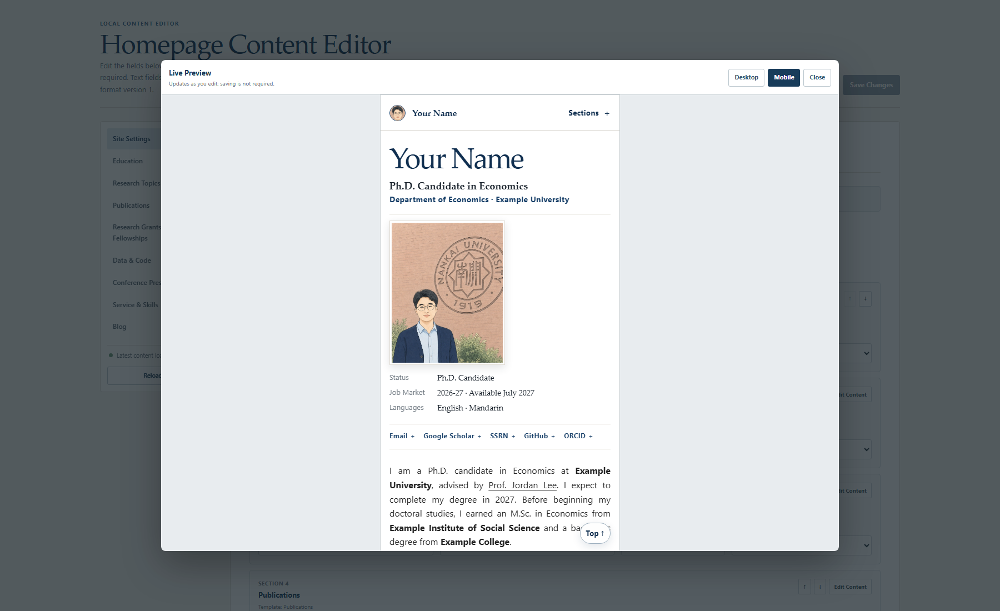

# 我做了一个可视化学术主页模板：不用手改组件，也能维护论文、CV 和博客


先说明一点：现在已经有一些面向研究者的商业建站服务，可以通过表单或可视化编辑器创建个人主页。它们通常开箱即用，也省去了自己配置服务器和部署流程的麻烦，对于只想尽快上线一个网站的人来说，是很方便的选择。

但如果你不希望把个人主页长期绑定在某一家商业建站平台上，更希望个人资料、论文、图片、CV 和页面文件都保存在自己的仓库里，可以用 Git 查看历史并随时迁移，那么可以试试我最近开源的 **ScholarCanvas**。

它是一个学术主页模板，但我更愿意把它叫作一个“学术主页工作区”——你可以在本地可视化编辑个人资料、论文、CV、博客和自定义栏目，实时预览电脑端与手机端效果，再把生成的纯静态网站发布到 GitHub Pages。以后如果不想继续使用 GitHub Pages，也可以把静态网站迁移到其他托管服务。

- GitHub：[yxb-cn/scholarcanvas](https://github.com/yxb-cn/scholarcanvas)
- 在线演示：[ScholarCanvas Demo](https://yxb-cn.github.io/scholarcanvas/)
- 协议：MIT

## 为什么要再做一个学术主页模板？

现在并不缺好看的学术主页模板，很多成熟项目也已经支持 Markdown、BibTeX、响应式布局和自动部署。

但真正开始长期维护后，内容往往仍然分散在不同地方：更新论文需要修改 BibTeX 或 Markdown 元数据；新增自定义栏目可能涉及配置文件、内容目录、页面模板和导航；更换头像、更新 CV、补一篇博客，也要把文件放到约定目录并写对路径。移动端适配通常已经由模板处理，但修改后的长标题、作者列表、照片和附件是否显示正常，仍然需要自己启动预览并逐项检查。

这些操作对熟悉静态网站的人并不复杂，但对只想维护学术内容的研究者来说，依然存在一层不必要的项目结构和文件管理成本。

所以我做 ScholarCanvas 时，重点不是“再设计一套页面”，而是把原本散落在配置文件、内容文件和资源目录里的维护工作，集中到一个为学术主页设计的可视化工作区里：

> **能不能让学术主页像填写内容管理系统一样直观，同时仍然保留 Git 仓库的透明、可审查和可迁移？**


## 它具体能做什么？

### 1. 在一个可视化编辑器里管理整个主页

个人简介、联系方式、教育经历、研究方向、论文、项目、代码、报告和服务经历，都可以在同一个编辑器里维护。

栏目支持新增、删除、重命名、排序、隐藏，以及调整在导航栏中的位置。Teaching、Awards、Work Experience、Courses、Blog 等内容，也可以用现有栏目模板快速创建。

修改最终会写回普通的仓库文件，而不是锁在某个平台或数据库里。你仍然可以查看差异、使用 Git 版本管理，也可以随时迁移。

### 2. 保存之前，先看电脑端和手机端效果

编辑器内置了实时预览。文字、导航、照片或长摘要还没写入磁盘时，就能切换桌面端和手机端检查最终效果。


这对学术主页尤其有用：作者列表、论文标题和摘要往往很长，桌面端看着正常，到了手机上却不一定。

### 3. 为论文维护单独设计了一套工作流

ScholarCanvas 支持：

- 一次性导入完整的 `.bib` 文件；
- 在不同论文状态之间拖放条目；
- 保留期刊、卷、期、页码和年份；
- 标记通讯作者；
- 单独控制每篇论文是否显示；
- 在摘要中使用 Markdown 和 LaTeX。

也就是说，它不只是一个“改文字和图片”的通用编辑器，而是尽量贴近研究者真实维护主页的方式。

### 4. 博客和独立页面也不用离开编辑器

你可以直接编写或导入 Markdown，预览 LaTeX，自动生成目录，并为每篇内容上传图片或 PDF。

每个页面的正文与附件都会保存在独立文件夹里，结构清楚，方便一起提交到仓库，也不会把内容绑定在某个在线写作平台中。



### 5. 发布后是纯静态网站

本地编辑器负责写入内容；部署后的主页是只读的静态网站，不需要额外服务器或数据库。

项目内置 GitHub Pages 工作流，可以自动识别根站点和项目站点的网址，并处理资源路径、规范链接、站点地图和搜索信息。

简单来说，日常更新流程就是：

1. 打开本地编辑器；
2. 修改并预览内容；
3. 保存；
4. 提交并推送到 GitHub；
5. 等待 GitHub Pages 自动更新。

## 怎么开始？

在 GitHub 仓库页面点击 **Use this template**，把新仓库克隆到本地。

Windows 用户双击：

```text
Open Homepage Editor.cmd
```

macOS 用户双击：

```text
Open Homepage Editor.command
```

第一次启动会安装依赖并打开本地编辑器。熟悉命令行的话，也可以运行：

```bash
pnpm install
pnpm editor
```

编辑完成后，在 GitHub 的 **Settings → Pages** 中选择 **GitHub Actions**。以后每次推送到 `main`，主页都会自动构建和发布。

项目需要 Node.js 22.13 或更高版本。

## 它适合谁？

我觉得 ScholarCanvas 比较适合：

- 想搭个人学术主页，但不想长期手改前端代码的同学；
- 需要频繁更新 working paper、publication、talk 和 CV 的研究者；
- 希望主页内容留在自己仓库里，而不是绑定在某个 SaaS 平台上的人；
- 想用 GitHub Pages 免费托管，同时保留完整版本历史的人。

如果你完全不想接触 GitHub，也不愿意在本地安装 Node.js，那么它可能还不是最省事的选择。它解决的是“降低维护学术主页的前端门槛”，而不是把 Git 和部署流程全部隐藏起来。

## 最后

ScholarCanvas 刚刚公开，目前还是一个很新的项目。

如果你正准备搭学术主页，欢迎试试看；如果你已经有自己的主页，也欢迎告诉我，你最希望可视化编辑器继续解决哪个维护痛点。

觉得有用的话，可以在 GitHub 点一个 Star。遇到问题或有功能建议，也欢迎提 Issue。

项目地址：[https://github.com/yxb-cn/scholarcanvas](https://github.com/yxb-cn/scholarcanvas)

---

**建议添加的话题：** 学术主页、科研工具、GitHub、开源项目、个人网站
